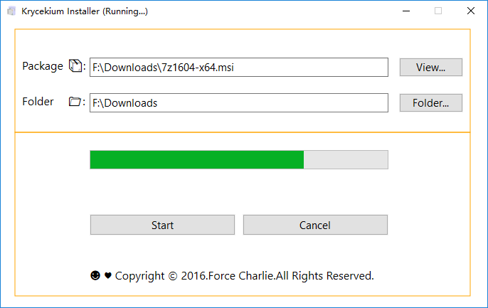

# Krycekium Installer

Krycekium Installer is a Windows Installer Package Unpack tools.

This App use Msi API, `MsiSetInternalUI` , `MsiSetExternalUIW`  and `MsiInstallProductW`

MsiInstallProductW can set Command in order to unpack only:

>ACTION=ADMIN TARGETDIR="/path/to/unpackdir"


```c++
INSTALLUILEVEL WINAPI MsiSetInternalUI(
	_In_ INSTALLUILEVEL  dwUILevel,     // UI level
	_Inout_opt_ HWND  *phWnd);          // handle of owner window
	
INSTALLUI_HANDLERW WINAPI MsiSetExternalUIW(
	_In_opt_ INSTALLUI_HANDLERW puiHandler,  // for progress and error handling 
	_In_ DWORD              dwMessageFilter, // bit flags designating messages to handle
	_In_opt_ LPVOID             pvContext);  // application context

UINT WINAPI MsiInstallProductW(
	_In_ LPCWSTR      szPackagePath,        // location of package to install
	_In_opt_ LPCWSTR      szCommandLine);   // command line <property settings>
```

## Screenshot

Running:



Completed:

